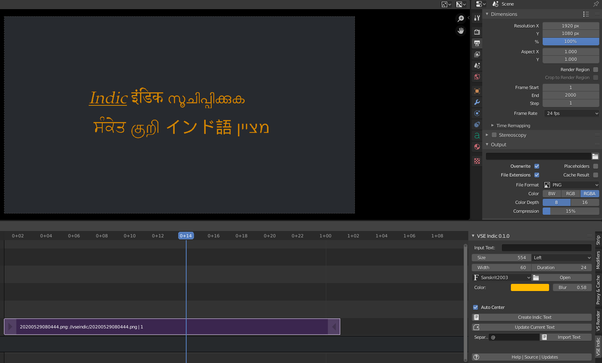

# VSE Indic
A free and open source addon for Blender. It renders text in Indic or any other complex languages accurately in Blender's video sequence editor.

---

---

**Requirements**

* Blender 2.80 or above (_This addon was tested in Blender 2.82_)
* pyvips
* libvips

**Features**

* Render complex unicode text accurately in VSE
* Supports multiline text
* Alignment
* Colors, soft shadows, fonts etc
* Imports from a text file and sequences the text slides (e.g for slides or subtitles)

**Intro**

Current Blender cannot render Indic text or any other complex unicode text properly. Hopefully this will be fixed in future versions of Blender. As a workaround, this addon renders the text using pyvips package as images and utilizes these images as strips in VSE. It has additional features compared to the good old Text Effect strips.

**Intro Video**

Coming soon

**Download and Installation**

*Install pyvips and libvips*

In terminal go to blender's python directory and execute these commands:

`cd /home/myuser/Programs/blender-2.82-linux64/2.82/python/bin`

`./python3.7m -m ensurepip`

_Change 3.7m to the actual version if required_

`./python3.7m -m pip install pyvips`

`sudo apt-get install -y libvips`

This command should show the lib.

`ldconfig -p | grep vips`

Start Blender and in python console type:

`import pyvips`

It should show no errors.

_For Windows there will be a similar procedure. Search for it._

*Install the addon*

Download the VSEIndic.py file from this repository. Or get the zip file from the releases page.
https://github.com/oormicreations/VSEIndic/releases

Install from the Blender Menu > Edit > Preferences > Add-ons > Install. Enable this addon. You will find the UI in the Video Sequencer window when you press N.

Some versions of Blender may not show the UI or addon. Try installing the python file directly after unzipping the zip.

**Usage**

Just click the **Create Indic Text** button!

It should show the default text rendered in Preview.

Enter your text in the text box, or paste it there, and click the **Create Indic Text** button.

To display line breaks, just insert **\n** in the text. If the pasted text has line breaks, they will be used. To get italics or underlined text you can use standard HTML style markup like `<i>xyz</i>` and `<u>xyz</u>`.

_The pasted text may not appear in the text box correctly, or can appear as boxes, but nothing to worry, the addon will render it correctly._

You can set the **Size** (in DPI), **Alignment**, **Width** of text (in % of rendered video's width), **Duration** of the strip and **Track** number. You can also select a **Font** from the drop down box or load a font file from **Open** button. You can set the text **Color** by clicking on the color swatch.

The **Blur** feature blurs the text, which should be useful for adding soft shadows to the text, by placing the blurred version of text below the unblurred strip. Change the color to something darker and adjust the Opacity and Offset of the blurred strip to get the desired effect.

The **Auto Center** checkbox will center the text in the rendered image.

You can make more changes and click **Update Current Text** to update it.

You can import unicode text from a file and produce a sequence of hundreds of text strips in a single click by clicking the **Import Text** button. Specify the **Separator** character in the neighbouring box. If you wish to import one line per strip just type **\n** as separator.

**Fit in range** will automatically fit the imported text within the specified range of frames. (Duration setting will be ignored).

**Help | Source | Updates** brings you to this page on GitHub.

**Notes**

* You will need unicode fonts installed for the text to show up correctly. All fonts may not work. For Indic languages **Sanskrit2003.ttf** works nicely. It can be freely downloaded from many websites.

* The generated text images are saved in a folder named **vseindic** in the same folder as your blend file. The images are named either serially or with date-time. These are **not** temporary images, if you delete them, your blend file will become useless.

* The cursor advances to the end of newly added strip automatically, so the next text gets sequenced after it.

**Known Issues**

* The color may appear darker than the value set.
* **Always save your stuff!**

**Misc Info**

This plugin has been released under MIT license, which means it is free for any kind of use and modification, but has no warranties or liabilities. Please read the license before you download and use it. 

**About**

A FOSS Project by Oormi Creations.

http://oormi.in

A limited support is available via email.

oormicreations@gmail.com

May 2020.

